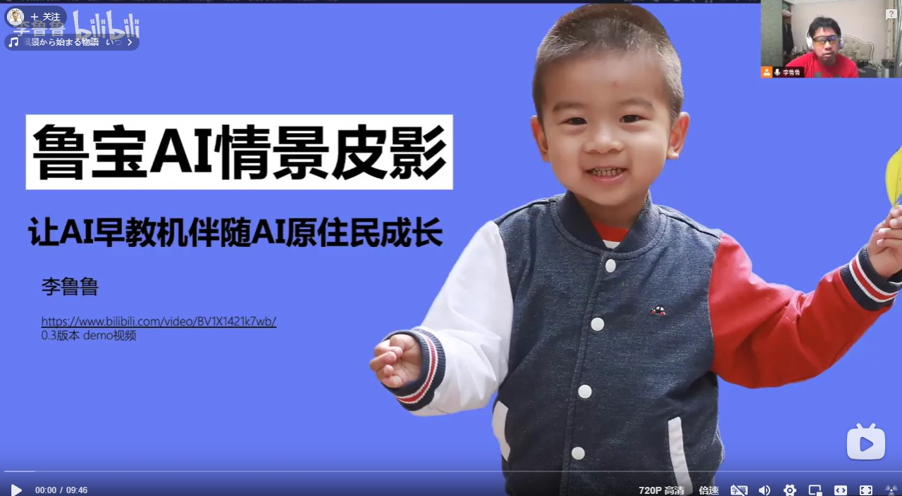
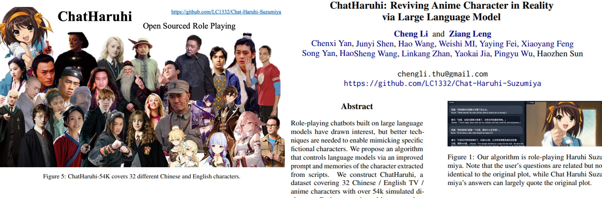
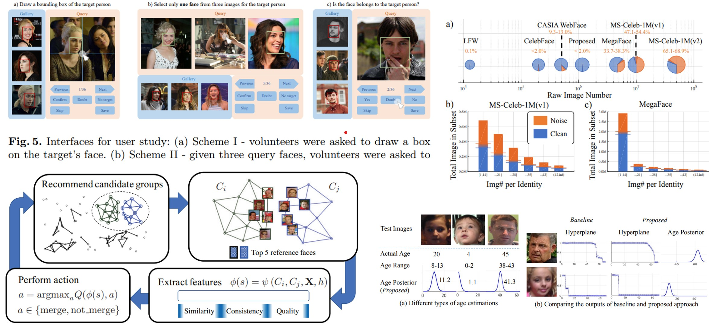
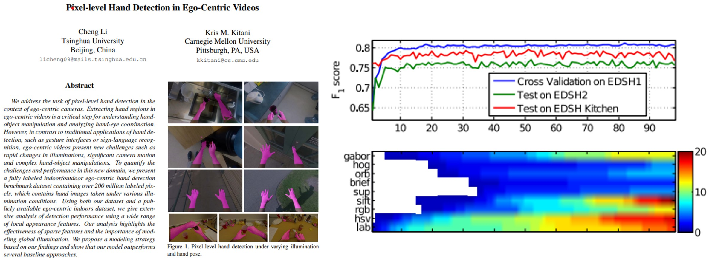
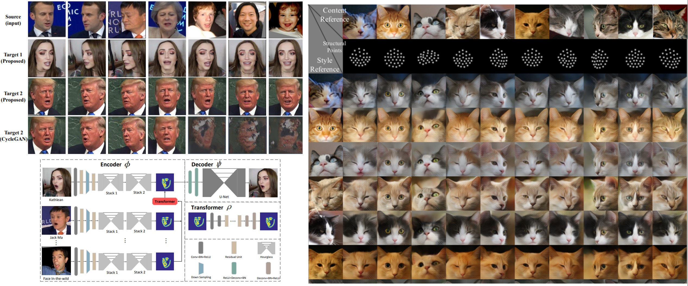

# 李鲁鲁老师的个人主页
# Cheng Li's Personal Homepage

## About Me

李鲁鲁是一个计算机视觉的研究者，在2012-2020期间进行了很多计算机视觉的研究以及产品化的实践。随着2022大型语言模型的兴起，以及借助Copilot协同工具，李鲁鲁开始学习新的AI技术并且在大模型应用以及跨模态的模型应用中做着更多的尝试。

  
过往经历

Li Cheng, Co-founder and Principal Researcher, graduated with a Bachelor's degree from the 数理基础科学(Physics) at Tsinghua University. During his undergraduate studies, he published his first two papers in CVPR and ICCV, and his related projects won the 全国挑战杯特奖(National Challenge Cup Special Prize). He participated with the Automation Department team in the RoboCup Soccer Adult League, where they won second place. After graduating in 2013, he joined SenseTime Technology as a co-founder, and the company went public on the Hong Kong Stock Exchange in 2021. During his tenure, he published over ten papers at conferences such as CVPR, ICCV, AAAI, and ECCV, with a total citation count exceeding 6,500. His related products, such as facial recognition albums, served several mobile phone clients, including OPPO and Vivo. His primary research areas include facial recognition, facial generation, and human-computer interaction. He is the initiator of the open-source project ChatHaruhi. Since participating in the 阿里魔搭黑客松(Modelscope Hackathon) in 2023, he has joined and won multiple hackathons exploring new AI applications, such as language models and SD models.

Contact: chengli.thu_at_gmail.com

## Recent News (2024)

### 鲁宝早教机

<!-- <iframe src="//player.bilibili.com/player.html?isOutside=true&aid=1255774167&bvid=BV1VJ4m1u7qZ&cid=1589334343&p=1" height="300" scrolling="no" border="0" frameborder="no" framespacing="0" allowfullscreen="true"></iframe> -->

[https://www.bilibili.com/video/BV1VJ4m1u7qZ](https://www.bilibili.com/video/BV1VJ4m1u7qZ)

在2024年，李鲁鲁开始更多关注能够让前沿AI技术进一步落地的领域。早教机是我为鲁宝做的一个原型，但是我也希望这个项目能够发展为一个kickstart的产品，能够让二鲁以及更多孩子真正使用到。

### Learning Python with Copilot

感谢于ChatGPT和Copilot的发展，使得我拥有了更活跃的开发能力。所以我正在编写[一门课程](https://github.com/LC1332/Learn-Python-with-GPT)，希望能够教会更多的初学者和中学生与最新的技术一起协同进化。

### FaceChain Competition

[Meme-Master](https://atomgit.com/chengli-thu/Meme-Master/tree/master/Meme-Master) 项目获得FaceChain挑战赛赛道五一等奖，奖金五万，感谢开放原子能基金会。这个项目主要练手训一下Stable Diffusion和ControlNet。

### New Version of Zero-Haruhi

我们收集了40万组角色扮演对话数据，来进行角色扮演模型的训练。[Chat-Haruhi-3.0](https://github.com/LC1332/Zero-Haruhi) 如果需要这个数据的话联系我。目前项目有点停滞，如果有空后面想扩展到多模态动画片。

## Education
- **BS in Physics and Mathematics (2009-2013)**
  - Tsinghua University, Department of Physics
- **High School (2006-2009)**
  - High School affiliated to Fudan University

## Publications

点击[Scholar](https://scholar.google.com/citations?user=F5rVlz0AAAAJ&hl=en) 查看更多细节

### ChatHaruhi

ChatHaruhi是个有趣的尝试，这里面的作者除了我和冷子昂以外都是社区招募的。是一个完全开源的工作。在ChatHaruhi里面我们使用了小说等源头抽取的角色数据进行了模型的角色扮演。并且在后面一个测试中，我们还测试了各个角色的MBTI的准确率。MBTI测试的文章由鑫涛整理，论文被ACL 2024接收。

- **Cheng Li**, Ziang Leng, Chenxi Yan, etal. "Chatharuhi: Reviving anime character in reality via large language model", *arXiv preprint arXiv:2308.09597*, 2023 (cited by 25).

- Xintao Wang, Yunze Xiao, Jen-tse Huang, Siyu Yuan, Rui Xu, Haoran Guo, Quan Tu, Yaying Fei, Ziang Leng, Wei Wang, Jiangjie Chen, **Cheng Li**, Yanghua Xiao, "Does role-playing chatbots capture the character personalities? assessing personality traits for role-playing chatbots", *arXiv preprint arXiv:2310.17976*, 2023 (cited by 20).

---

### Face Grouping and Face Data Clean

在2016年之前，我们尝试了很多数据标注的不同方法。同时，我们还设计了一种强化学习/Meta-learning的方法，去学习聚类的规则进行人脸聚类。相应的算法改进后应用于很多国内手机的相册应用中。

Fei Wang, L Chen, **Cheng Li**, S Huang, Y Chen, C Qian, CC Loy, "The devil of face recognition is in the noise", *Proceedings of the European Conference on Computer Vision (ECCV)*, 2018 (cited by 231).

Yue He, Kaidi Cao, **Cheng Li**, C Loy, "Merge or not? learning to group faces via imitation learning", *Proceedings of the AAAI Conference on Artificial Intelligence*, 2018 (cited by 24).

其实我觉得这个聚类的方法潜力还挺大的，如果有人想试可以试一下用更好的图/文特征去做文档的聚类。想做的话也欢迎与我联系。

Yunxuan Zhang, Li Liu, **Cheng Li**, C Loy "Quantifying facial age by posterior of age comparisons", *arXiv preprint arXiv:1708.09687*, 2017 (cited by 98).

这篇是我们用多次比较去标年龄的方法，比较标注法在颜值、年龄等很多数据上都有实践。

---

### Ego-centric Hand Detection

Hand Detection是我先后去CMU时候Kris Kitani指导我做的研究。

- **Cheng Li**, KM Kitani, "Pixel-level hand detection in ego-centric videos", *Proceedings of the IEEE conference on computer vision and pattern recognition (CVPR)*, 2013 (cited by 331).

- **Cheng Li**, KM Kitani**, "Model recommendation with virtual probes for egocentric hand detection", *Proceedings of the IEEE International Conference on Computer Vision (ICCV)*, 2013 (cited by 87).

---

### Face Reenactment

- W Wu, Y Zhang, **Cheng Li**, C Qian, CC Loy, "Reenactgan: Learning to reenact faces via boundary transfer", *Proceedings of the European conference on computer vision (ECCV)*, 2018 (cited by 223).

- Yunxuan Zhang, S Zhang, Y He, **Cheng Li**, CC Loy, Z Liu, "One-shot face reenactment", *arXiv preprint arXiv:1908.03251*, BMVC 2019 (cited by 57).

- **W Wu, K Cao, C Li, C Qian, CC Loy**, "Disentangling content and style via unsupervised geometry distillation", *arXiv preprint arXiv:1905.04538*, ICLR 2019 (cited by 18).

## Publications

1. **F Wang, M Jiang, C Qian, S Yang, C Li, H Zhang, X Wang, X Tang**, "Residual attention network for image classification", *Proceedings of the IEEE conference on computer vision and pattern recognition (CVPR)*, 2017 (cited by 4228).

2. **S Zhu, C Li, C Change Loy, X Tang**, "Face alignment by coarse-to-fine shape searching", *Proceedings of the IEEE conference on computer vision and pattern recognition (CVPR)*, 2015 (cited by 651).
3. 
4. 
5. 
6. **S Zhu, C Li, CC Loy, X Tang**, "Unconstrained face alignment via cascaded compositional learning", *Proceedings of the IEEE Conference on Computer Vision and Pattern Recognition (CVPR)*, 2016 (cited by 208).
7. **J Wu, K Long, F Wang, C Qian, C Li, Z Lin, H Zha**, "Deep comprehensive correlation mining for image clustering", *Proceedings of the IEEE/CVF international conference on computer vision (ICCV)*, 2019 (cited by 205).
8. **K Cao, Y Rong, C Li, X Tang, CC Loy**, "Pose-robust face recognition via deep residual equivariant mapping", *Proceedings of the IEEE Conference on Computer Vision and Pattern Recognition (CVPR)*, 2018 (cited by 174).
9. **W Wu, K Cao, C Li, C Qian, CC Loy**, "Transgaga: Geometry-aware unsupervised image-to-image translation", *Proceedings of the IEEE/CVF conference on computer vision and pattern recognition (CVPR)*, 2019 (cited by 127).

12. **Y Rong, Z Liu, C Li, K Cao, CC Loy**, "Delving deep into hybrid annotations for 3d human recovery in the wild", *Proceedings of the IEEE/CVF International Conference on Computer Vision (ICCV)*, 2019 (cited by 69).

14. **W Liu, J Chen, C Li, C Qian, X Chu, X Hu**, "A cascaded inception of inception network with attention modulated feature fusion for human pose estimation", *Proceedings of the AAAI Conference on Artificial Intelligence*, 2018 (cited by 45).
15. **ZW Wang, SC Jiang, GL Yuan, T Wu, C Li, C Qian, C Jin, C Yu, WJ Hua**, "Strain effect on the orientation-dependent harmonic spectrum of monolayer aluminum nitride", *Science China Physics, Mechanics & Astronomy*, 2020 (cited by 40).

19. 
20. **S Zhu, C Li, CC Loy, X Tang**, "Towards arbitrary-view face alignment by recommendation trees", *arXiv preprint arXiv:1511.06627*, 2015 (cited by 10).

希望这有帮助！如果你有任何问题，请告诉我。

## Experience

<!-- - **Co-founder, Lead Researcher (2013-present)**
  - SenseTime (SenseTime is a start-up company providing vision solutions to companies in China, Platinum Sponsor in CVPR 2015, ICCV 2015)
  - **Projects:**
    - Face Detection (Frontal, MultiView, Cascade CNN Detector)
    - Face Alignment (Cascade Regression, SDM, CNN)
    - Face Verification (Joint Bayesian, Transfer Learning, DeepID2+)
    - Image Enhancement (dehaze, super-resolution, etc.) -->

- **Student Intern (Spring 2013 & Summer 2012)**
  - Carnegie Mellon University, Robotic Institute, advised by Kris Kitani & Martial Hebert
  - **Projects:**
    - Egocentric Hand Detection (Segmentation)
    - Adaptive Model Recommendation System
    - Low-level Feature Selection
    - Post-processing with Time-Space MRF

- **Chief Developer (2009-2012)**
  - Tsinghua Hephaestus RoboCup Team (1.3m-tall Humanoid Soccer Robot), advised by Mingguo Zhao
  - **Projects:**
    - Designed and refactored vision system for soccer humanoid robot
    - Goals, beacons, and field recognition algorithm
    - Self-Localization algorithm based on particle-filter

- **Research Assistant (2011-2012)**
  - Tsinghua University, advised by Mingguo Zhao
  - **Projects:**
    - Designed Controller for a variable-impedance/nature-dynamic system
    - Implemented a Simulation Platform for the system on MATLAB

## Selected Awards
- **10/13** "Challenge Cup" National Science and Technology College of extra-curricular academic competition works, Outstanding Award (Top 3/300)
- **07/12** RoboCup2012 in Mexico, Humanoid League AdultSize, 2nd Place
- **07/11** RoboCup2011 in Turkey, Humanoid League AdultSize, 3rd Place
- **06/10** RoboCup2010 in Singapore, Humanoid League AdultSize, 3rd Place
- **02/11** American Mathematical Contest in Modeling, Honorable Prize
- **05/10** Mathematical Contest in Modeling in Tsinghua University, Top 4 (120 teams)

### Before University
- **10/08** National Physic Olympiad Competition in Provinces, First Prize in Shanghai (top 30 of 20 thousand participants)
- **11/07 & 11/08** National Olympiad in Informatics in Provinces, First Prize in Shanghai (top 30)
- **11/08** The 8th Awarding Program For Future Scientists, First Prize (4th Place), (The largest pre-college scientific research event in China)

## Skills
- **Coding:** Skilled in C/C++, MATLAB (including mex compiler and GUI), OpenCV
- **Mathematics:** Computer Vision, Machine Learning, Statistical Inference, Probabilistic Robotics, Basic Graphic, Convex Optimization
- **Deep Learning:** Caffe, Keras (Theano Based), Fundamentals of Deep Learning

## Links
- [Google Scholar](https://scholar.google.com.hk/citations?user=F5rVlz0AAAAJ)
- [arXiv](http://arxiv.org/abs/arxiv)

<!--
**LC1332/LC1332** is a ✨ _special_ ✨ repository because its `README.md` (this file) appears on your GitHub profile.

Here are some ideas to get you started:

- 🔭 I’m currently working on ...
- 🌱 I’m currently learning ...
- 👯 I’m looking to collaborate on ...
- 🤔 I’m looking for help with ...
- 💬 Ask me about ...
- 📫 How to reach me: ...
- 😄 Pronouns: ...
- ⚡ Fun fact: ...
-->
